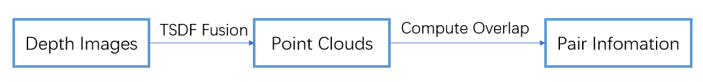
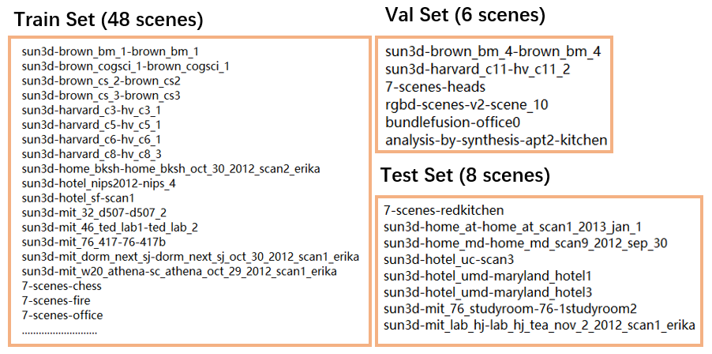

# 3DMatch Registration Dataset

With the rapid development on the topic of **point cloud registration**, current methods typically create their own custom registration dataset based on the indoor benchmark [3DMatch](https://openaccess.thecvf.com/content_cvpr_2017/html/Zeng_3DMatch_Learning_Local_CVPR_2017_paper.html).

So this repo shows how to **create your own point cloud registration dataset from the official 3DMatch benchmark.**

## Pipeline Overview



Note: You can generate these data yourself by following these steps, or you can just download the data that has already been generated -> [download](#download)

## 3DMatch Dataset Explanation

[3DMatch Reconstruction Datasets](https://3dmatch.cs.princeton.edu/) contain **62 *.zip files**, with each file corresponding to an **indoor scene** of RGB-D image sequences. 

```shell
├── /data/3DMatch_zip/  
│   ├──	sun3d-brown_bm_1-brown_bm_1.zip
│   ├── sun3d-brown_bm_4-brown_bm_4.zip
│   ├── sun3d-brown_cogsci_1-brown_cogsci_1.zip
│   ├── ...
```

Then unzip all *.zip files, and one will get the output depth image sequences which are arranged like this:

```shell
├── /data/3DMatch_depth/
│   ├── sun3d-brown_bm_1-brown_bm_1/
│   │   ├── camera-intrinsics.txt  
│   │   ├── seq-01/
│   ├── sun3d-brown_bm_4-brown_bm_4/
│   │   ├── camera-intrinsics.txt  
│   │   ├── seq-01/
│   ├── sun3d-brown_cogsci_1-brown_cogsci_1
│   ├── ...
```

**seq-0*** contains a sequence of depth images of an indoor scene, which could be further used to create point clouds.

## Train & Val & Test Split 

As shown above, 3DMatch contains a total of **62** scenes of image sequences, which are officially split ([split.txt](https://vision.princeton.edu/projects/2016/3DMatch/downloads/rgbd-datasets/split.txt)) into **54 scenes** for training, and **8 scenes** for testing.  

For **54** training scenes, one can further pick several scenes from them and categorize them as the **val** set. Here for example:



## TSDF Fusion (depth images -> point clouds)

We use the original [3DMatch-toolbox](https://github.com/andyzeng/3dmatch-toolbox) for TSDF fusion, which is implemented with **OpenCV** and **Matlab**, although there is a much easier-to-use python alternative [fuse_fragments_3DMatch.py](https://github.com/XuyangBai/PPF-FoldNet/blob/master/script/fuse_fragments_3DMatch.py) for TSDF fusion, here we keep with the inconvenient but original way of creating point clouds.

- OS: ubuntu18.04
- CUDA: 11.1
- CUDNN: 8.2.1
- OpenCV 3.4.1
- Matlab R2017a

#### OpenCV Configuration

install **OpenCV 3.4.1** (skip this if you can install OpenCV by yourself)

```shell
>> sudo apt install cmake
>> sudo apt install libgtk2.0-dev
>> sudo apt install pkg-config
>> sudo apt install ffmpeg
>> sudo apt install libavcodec-dev
>> sudo apt install libavformat-dev
>> sudo apt install libswscale-dev
>> unzip opencv-3.4.1.zip
>> cd opencv-3.4.1
>> mkdir build
>> cmake -D WITH_TBB=ON -D WITH_EIGEN=ON -D OPENCV_GENERATE_PKGCONFIG=ON  -D BUILD_DOCS=ON -D BUILD_TESTS=OFF -D BUILD_PERF_TESTS=OFF -D BUILD_EXAMPLES=OFF  -D WITH_OPENCL=OFF -D WITH_CUDA=OFF -D BUILD_opencv_gpu=OFF -D BUILD_opencv_gpuarithm=OFF -D BUILD_opencv_gpubgsegm=O -D CMAKE_BUILD_TYPE=RELEASE -D CMAKE_INSTALL_PREFIX=/usr/local ..
>> make -j8
>> sudo make install
# write /usr/local/lib -> /etc/ld.so.conf.d/opencv.conf
# write export PKG_CONFIG_PATH=$PKG_CONFIG_PATH:/usr/local/lib/pkgconfig -> ~/.bashrc
>> source ~/.bashrc
>> ldconfig -v | grep opencv
```

#### Matlab Configuration

Somehow install Matlab on your system :)

I successfully install **Matlab R2017a** on **ubuntu18.04** following this [link](https://blog.csdn.net/dloading7/article/details/125620849?spm=1001.2014.3001.5501).

#### Fuse Depth Images into Point Clouds (train & val set)

```shell
>> git clone https://github.com/andyzeng/3dmatch-toolbox.git
>> cd 3dmatch-toolbox/depth-fusion
```

modify **compile.sh** (mostly change the cuda and cudnn directory):

```shell
elif uname | grep -q Linux; then
  CUDA_LIB_DIR=/usr/local/cuda-11.1/lib64
  CUDNN_LIB_DIR=/usr/local/cuda-11.1/lib64
fi

CUDNN_INC_DIR=/usr/local/cuda-11.1/include

nvcc -std=c++11 -O3 -o demo demo.cu -I/usr/local/cuda-11.1/include -I$CUDNN_INC_DIR -L$CUDA_LIB_DIR -L$CUDNN_LIB_DIR -lcudart -lcublas -lcudnn -lcurand -D_MWAITXINTRIN_H_INCLUDED `pkg-config --cflags --libs opencv
```

```shell
>> bash compile.sh
```

It will generate **demo** file under the current folder.

Then modify the **fuseSceneFragments.m** (the **fragmentsPath** points to the folder that will contain the TSDF fusion results):

```matlab
cudaBinPath = '/usr/local/cuda-11.1/bin';
cudaLibPath = '/usr/local/cuda-11.1/lib64';
cudnnLibPath = '/usr/local/cuda-11.1/lib64';
dataPath = '/data/3DMatch_depth'; 

fragmentsPath = '/data/3DMatch_output/train';
sceneList = {'sun3d-brown_bm_1-brown_bm_1', ...
             'sun3d-brown_cogsci_1-brown_cogsci_1', ...
             'sun3d-brown_cs_2-brown_cs2', ...
             xxxxx  % total 48 train scenes
             };
             
fragmentsPath = '/data/3DMatch_output/val';
sceneList = {'sun3d-brown_bm_4-brown_bm_4', ...
             'sun3d-harvard_c11-hv_c11_2', ...
             '7-scenes-heads', ...
             xxxxx  % total 6 val scenes
             };           
```

Then run **fuseSceneFragments.m** to get point clouds output:

```shell
## start TSDF fusion!
>> matlab -nodesktop -r fuseSceneFragments
```

After TSDF fusion, the **/data/3DMatch_output/train** will contain the fusion results of the 48 train scenes, while **/data/3DMatch_output/val** will contain the fusion results for 6 val scenes.

Now, the raw *.ply files of the **train & val** (48 + 6 scenes) sets have all been correctly generated, for example:

```shell
├── /data/3DMatch_output/
│   ├── train/
│   │   ├── sun3d-brown_bm_1-brown_bm_1/
│   │   │	├── cloud_bin_0.ply
│   │   │	├── cloud_bin_0.info.txt
│   │   │	├── ...
│   │   ├── sun3d-brown_cogsci_1-brown_cogsci_1/
│   │   │	├── cloud_bin_0.ply
│   │   │	├── cloud_bin_0.info.txt
│   │   │	├── ...
│   ├── val/
│   │   ├── sun3d-brown_bm_4-brown_bm_4/
│   │   │	├── cloud_bin_0.ply
│   │   │	├── cloud_bin_0.info.txt
│   │   │	├── ...
│   │   ├── sun3d-harvard_c11-hv_c11_2/
│   │   │	├── cloud_bin_0.ply
│   │   │	├── cloud_bin_0.info.txt
│   │   │	├── ...
```

the **cloud_bin_x.info.txt** contains the transformation matrix that will transform **cloud_bin_x.ply** to the global reference frame. 

<a id="testset"></a>

#### Download the Test set

As for the test set (8 scenes), there is no need to generate them yourself,  certainly one can modify the **sceneList** and **fragmentsPath** in **fuseSceneFragments.m** to generate them, but the original [3DMatch website](https://3dmatch.cs.princeton.edu/) has provided them for us, along with ground-truth transformation which could be downloaded at **Geometric Registration Benchmark** on the website.

Download them and place them at **/data/3DMatch_output/test**.

## Generate Overlap Info

In the task of Point Cloud Registration, one will need to compute the **overlap information** between fragments in order to generate training pairs:

```python
>> python cal_overlap.py --root /data/3DMatch_output/train --output_json train_info.json --ol_thres 0.3
>> python cal_overlap.py --root /data/3DMatch_output/val --output_json val_info.json --ol_thres 0.3
```

the **ol_thres** indicates that we only generate info for pairs with overlap ratio > ol_thres.

then the **overlap information** for the train and the val set will be stored at **train_info.json** and **val_info.json**.

## Conclusion

With all the procedures being correctly done, now the generated data can be arranged as follows:

```
├── train/
│   ├── sun3d-brown_bm_1-brown_bm_1/
│   ├── sun3d-brown_cogsci_1-brown_cogsci_1/
│   ├── ...
├── val/
│   ├── sun3d-brown_bm_4-brown_bm_4/
│   ├── sun3d-harvard_c11-hv_c11_2/
│   ├── ...
├── test/
│   ├── 7-scenes-redkitchen/
│   ├── 7-scenes-redkitchen-evaluation/
│   ├── ...
├── train_info.json
├── val_info.json
```

<a id="download"></a>

## Download

train.zip

val.zip

[test.zip](#testset)

train_info.json (overlap_ratio = 0.3)

val_info.json (overlap_ratio = 0.3)

## Reference

[3dmatch-toolbox](https://github.com/andyzeng/3dmatch-toolbox)

[PPF-FoldNet](https://github.com/XuyangBai/PPF-FoldNet)

[OverlapPredator](https://github.com/prs-eth/OverlapPredator)
